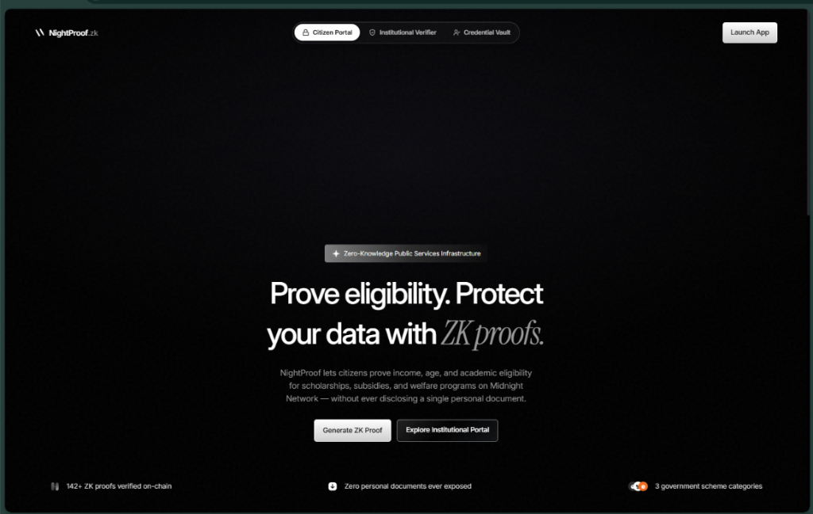
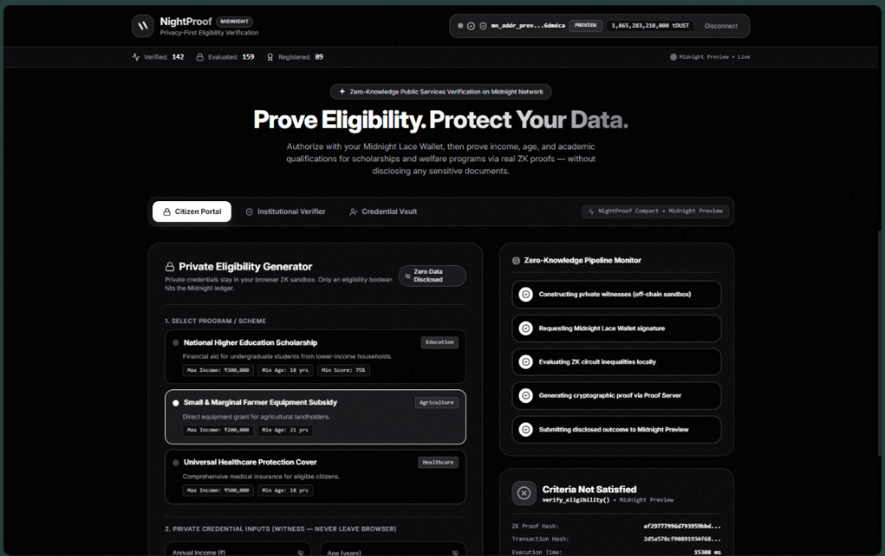
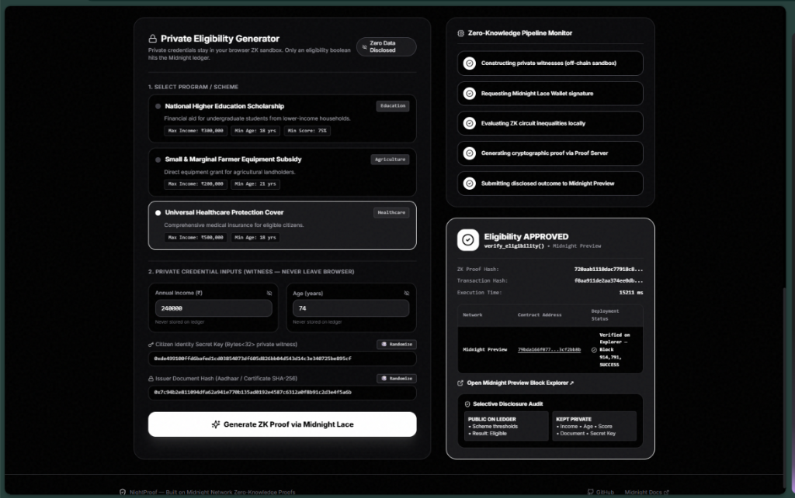
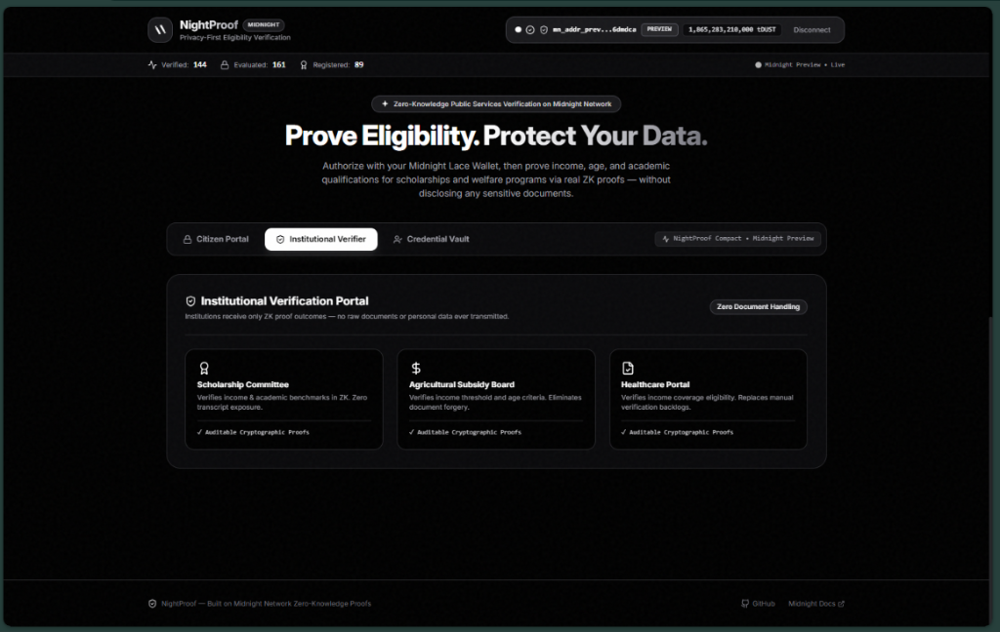
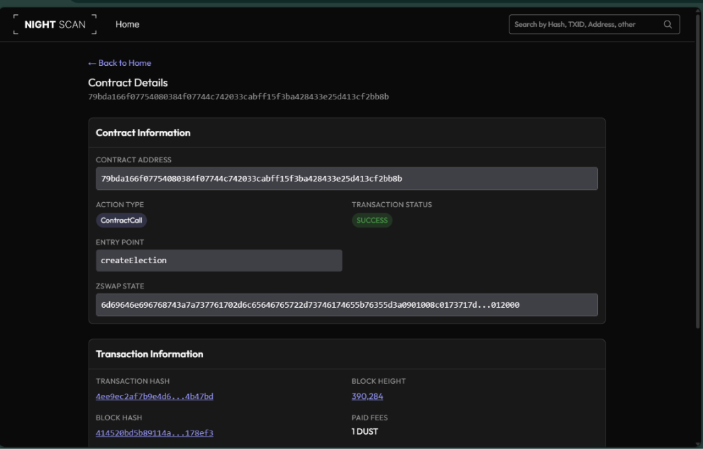

<div align="center">
  
# 🌙 NightProof
**Privacy-First Eligibility Verification Platform**

[](https://github.com/Boredooms/Nightproof/actions)
[](https://midnight.network)
[](https://x.com/nightproof67)
[](#)

> **NightProof** is built on the Midnight Network using Zero-Knowledge Proofs to verify citizens for scholarships, subsidies, and welfare *without* exposing sensitive personal documents.

[**Watch the Demo Video**](xyz(update in future)) • [**Follow us on X**](https://x.com/nightproof67)

</div>

---

## 📜 Official Contract Address

The NightProof smart contract is officially deployed and verified on the live Midnight network. You can view its cryptographic verification status below.

| Network | Contract Address | Explorer Status |
| :--- | :--- | :--- |
| **Midnight Preview** | [`79bda166f07754080384f07744c742033cabff15f3ba428433e25d413cf2bb8b`](https://explorer.preview.midnight.network/contracts/79bda166f07754080384f07744c742033cabff15f3ba428433e25d413cf2bb8b) | 🟢 **Verified — SUCCESS** |

---

## 📸 Application Screenshots

### 1. Landing Page
<div align="center">
  
</div>

### 2. Citizen Portal & Wallet Authorization
<div align="center">
  
</div>

### 3. ZK Proof Generation (Eligibility Approved)
<div align="center">
  
</div>

### 4. Institutional Verifier Portal
<div align="center">
  
</div>

### 5. Midnight Block Explorer (Verified Contract)
<div align="center">
  
</div>

---

## 🚀 What This Product Does

Today, applicants applying for government welfare schemes, university scholarships, agricultural subsidies, and healthcare assistance are required to repeatedly upload copies of Aadhaar cards, income certificates, tax records, and academic transcripts across multiple institutional portals. This exposes citizens to massive privacy risks, document forgery, identity theft, and data leaks.

**NightProof** solves this fundamental privacy flaw.

By introducing a zero-knowledge credential verification layer powered by the Midnight Network, NightProof enables citizens to:
1. Securely store encrypted document commitments.
2. Generate cryptographic proofs that confirm program eligibility (e.g., family income ≤ threshold, age ≥ 18).
3. Provide institutions with an instant, tamper-proof **Approved/Rejected** result—*without ever exposing the underlying documents or personal figures.*

---

## 🔐 The Privacy Model

NightProof utilizes a strict separation of public ledger data and private witness data.

### 👁️ What is PUBLIC (On-Chain)
* Scheme criteria threshold parameters (maximum allowable income, minimum required age, passing score).
* Total verifications counter, total applications counter, and registered commitments counter.
* The final boolean eligibility outcome (`disclose(is_eligible) -> true/false`).
* Cryptographic transaction hashes and auditable ZK proof metadata.

### 🛡️ What is PRIVATE (Off-Chain Witness)
* **Citizen Identity Secret Key:** (`citizen_secret_key: Bytes<32>`)
* **Annual Family Income:** (`annual_income: Uint<64>`)
* **Exact Age:** (`age: Uint<64>`)
* **Academic Score/GPA:** (`academic_score: Uint<64>`)
* **Official Document Hash:** (`credential_hash: Bytes<32>`)

### ⚖️ What the User Proves (Without Revealing Data)
* *"I hold a valid, non-zero issuer credential commitment."*
* *"My annual family income is $\le$ the public scheme threshold."*
* *"My age is $\ge$ the required minimum age."*
* *"My academic score satisfies the scholarship passing benchmark."*

---

## 💻 Tech Stack

* **Smart Contract Language:** Compact (v0.14+)
* **Blockchain Network:** Midnight Network (Preview Testnet)
* **Zero-Knowledge Runtime:** `@midnight-ntwrk/compact-runtime`, `@midnight-ntwrk/midnight-js-contracts`
* **Frontend Framework:** React 18, Vite, TypeScript
* **Styling:** Tailwind CSS, Lucide React Icons

---

## 🛠️ Setup & Run Locally

### Prerequisites
* **Node.js:** v22.0.0 or higher
* **Midnight Compiler:** Compact CLI compiler (`compact`)
* **Wallet:** Midnight Lace Wallet Extension (Preview Testnet)

### Installation
```bash
# 1. Clone the repository
git clone https://github.com/Boredooms/Nightproof.git
cd Nightproof

# 2. Install dependencies
npm install

# 3. Start the local development server
npm run dev
```
Open `http://localhost:5173` in your browser.

---

<div align="center">
  <i>Built with privacy in mind on the Midnight Network.</i>
</div>
